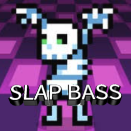
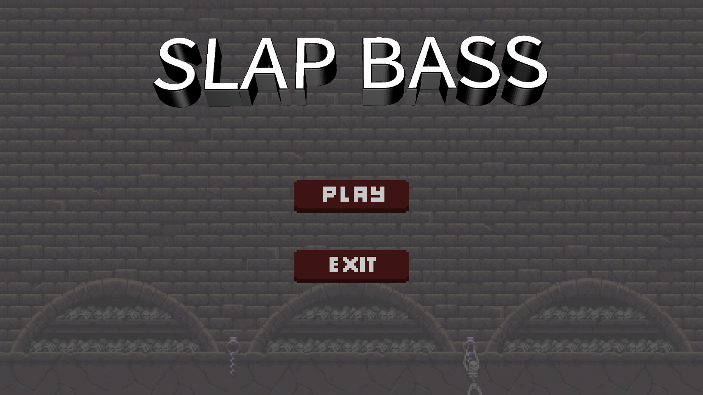
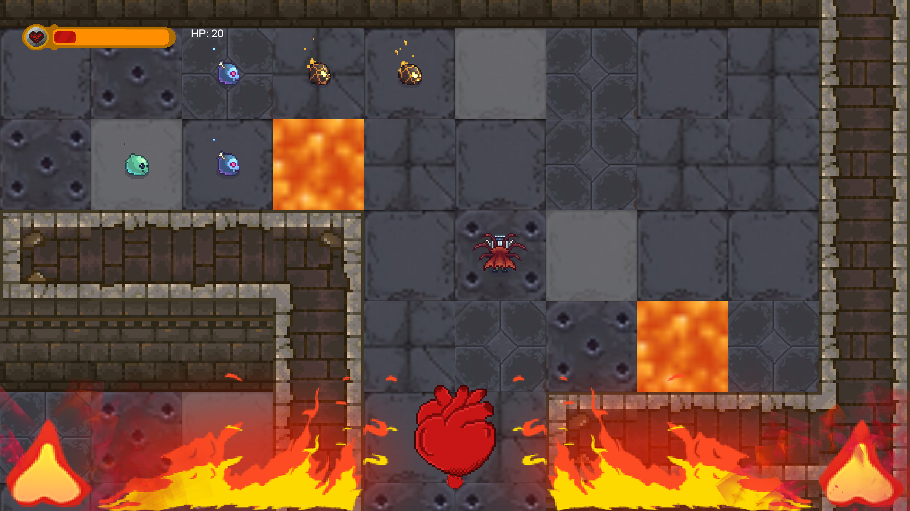

## ⚠️ Important Display Notice

This game runs in **full-screen mode**.

For the **best possible experience**, please **adjust your screen scaling to _100%_** in your computer’s **Settings** *before* launching the game.

> 💡 **How to change scaling on Windows**:  
> Go to **Settings** → **System** → **Display** → **Scale and layout** → Set **Scale** to **100%**

**⚠️ This step is crucial** — incorrect scaling may cause display issues, such as misplaced buttons or cropped visuals.  
Please make sure your system is set correctly to enjoy the game as intended.


# Slap Bass v3.0

Welcome to **Slap Bass v3.0**, the latest edition of the rhythm-based, turn-based grid strategy game! Building upon v1.0, this version features a larger map, a dynamic camera system, an upgraded HUD, full-screen support, and layered music tracks, greatly enhancing strategy depth and rhythmic immersion. Players control a character navigating a 20x20 grid, battling three types of Slime enemies (blue, yellow, and pink) in sync with a 100 BPM background beat.


## Features in v3.0

- **Expanded Map**: Upgraded from a 9x9 to a 20x20 grid for more exploration and strategy space.
- **Camera System**: Dynamically follows the player, showing a focused 9x9 viewport of the core game area.
- **HUD**: Displays player's HP with room for future expansions like more status info.
- **Fullscreen Mode**: Toggle with F11. Gameplay view is centered for immersive experience.
- **Dynamic Music Tracks**: Defeating certain enemies activates instrument tracks (drums, bass, keyboard), simulating a live performance.

## Game Highlights

- **Rhythm-Based Combat**: All moves and attacks must be executed within a 0.1-second beat window.
- **Movement as Attack**: Attacks are performed by moving into an enemy tile—no attack button needed.
- **Diverse Enemy AI**:
    - Blue Slime: A* pathfinding, moves every beat, priority 3, tied to drum track.
    - Yellow Slime: BFS pathfinding, moves every 2 beats, priority 2, tied to bass track.
    - Pink Slime: Greedy best-first pathfinding, moves every 3 beats, priority 1, tied to keyboard track.
- **Priority System**: Player has top priority (100), ensuring fair resolution of movement/attack conflicts.
- **Dynamic Map Textures**: Alternates between `map1.png` and `map2.png` to reflect rhythm visually.
- **Immersive Sound Effects**: Includes idle, move, attack, hurt, and death sounds alongside layered background music.
- **Rich Animations**: Directional animations (up/down/left/right) for both player and enemies including idle, running, attacking, hurt, and death.



## Installation Instructions

### System Requirements
- **OS**: Windows, macOS, or Linux
- **Java**: JDK 8 or later
- **Memory**: At least 512 MB RAM
- **Storage**: ~100 MB for game and resources

### Setup Steps
1. **Clone the repository**:
   ```bash
   git clone https://github.com/your-repo/Slap Bass.git
   cd Slap Bass
   ```
2. **Prepare Resources**:
- Ensure `src/main/resources/` contains:
    - Map textures: `map1.png`, `map2.png`
    - Background music: `base.wav`, `drum.wav`, `bass.wav`, `keyboard.wav`
    - Sound effects: `sounds/idle.wav`, `sounds/move.wav`, `sounds/attack.wav`, `sounds/hurt.wav`, `sounds/death.wav`
    - Sprites: animation assets under `player1/`, `Slime1/`, `Slime2/`, `Slime3/`
- If missing, contact the developer or use placeholder assets.
3. **Compile and Run**:
   ```bash
   javac com/hamhuo/massey/Slap Bass/core/*.java com/hamhuo/massey/Slap Bass/entity/*.java com/hamhuo/massey/Slap Bass/state/*.java
   java com.hamhuo.massey.Slap Bass.core.GameController
   ```

## Gameplay

- **Objective**: Defeat all enemies (blue/yellow/pink slimes) on the 20x20 grid without letting your HP reach 0.
- **Controls**:
    - **Arrow Keys**: Move to empty tiles (`RunState`) or enemy tiles (`AttackState`).
    - **F11**: Toggle fullscreen mode.
    - **ESC**: Exit game.
- **Rhythm Mechanics**:
    - Game runs at 100 BPM (0.6 seconds per beat).
    - Actions must be input within a 0.1-second window; otherwise, fallback to `IdleState`.
- **Combat**:
    - Each attack deals 10 damage. All characters start with 100 HP.
    - Player actions take precedence based on highest priority.
    - Enemies use their respective pathfinding methods to pursue and attack.
- **Music Tracks**:
    - Defeating enemies like blue slime activates related music layers (e.g., drums).
- **States**:
    - `Idle`: Waiting for input or beat.
    - `Run`: Move to a new tile.
    - `Attack`: Strike target tile or rollback if empty.
    - `Hurt`: Triggered on damage with animation.
    - `Death`: Triggered when HP ≤ 0, ends game.

## Contributing

We welcome contributions! Bug fixes, suggestions, and features are appreciated. Here's how to contribute:
1. Fork the repository.
2. Create a new feature branch: `git checkout -b feature/YourFeature`
3. Commit your changes: `git commit -m 'Add YourFeature'`
4. Push to your fork: `git push origin feature/YourFeature`
5. Submit a Pull Request.

### Suggested Improvements
- Implement win condition (e.g., defeat all enemies).
- Extend HUD to show enemy HP or beat indicators.
- Support adjustable BPM or difficulty modes.
- Add obstacles to enrich pathfinding challenge.
- Enhance music layering with visual cues.

## Acknowledgments

Special thanks to all testers and contributors! Shoutouts to:
- [Yinghuan](https://gitee.com/ddd020622)
- [Shi Dou Jia](https://gitee.com/shi-dou-jia)
- [Jiapeng Shang](https://gitee.com/shang-jiapeng)

## License

This project is licensed under the MIT License. See the [LICENSE](LICENSE) file for details.

---

**Slap Bass v3.0** — Where rhythm meets strategy!


Game background source:
https://jonik9i.itch.io/free-pixel-dungeon-game-asset#google_vignette